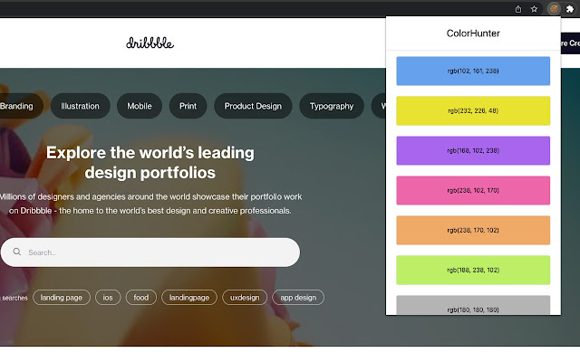

<p align="center" width="100%">
	
</P>

Chrome Extenstion to export the color palette of a website in a single click.

[](https://choosealicense.com/licenses/mit/)


## Installation

[Chrome Web Store](https://chrome.google.com/webstore/detail/color-hunter/bpgkpfghcehfbffdfhelbooocbafaakd/)

## Screenshots

<p align="center" width="100%">
	
</P>

## Run Locally

Clone the project

```bash
  git clone https://github.com/plsankar/colorhunter
```

Go to the project directory

```bash
  cd colorhunter
```

Install dependencies

```bash
  npm install
```

Run development build

```bash
  npm run dev
```

or run the production build

```bash
  npm run build
```

## Support

For support or feedback email [me@lakshmisankar.com](me@lakshmisankar.com).

## License

[MIT](https://choosealicense.com/licenses/mit/)
